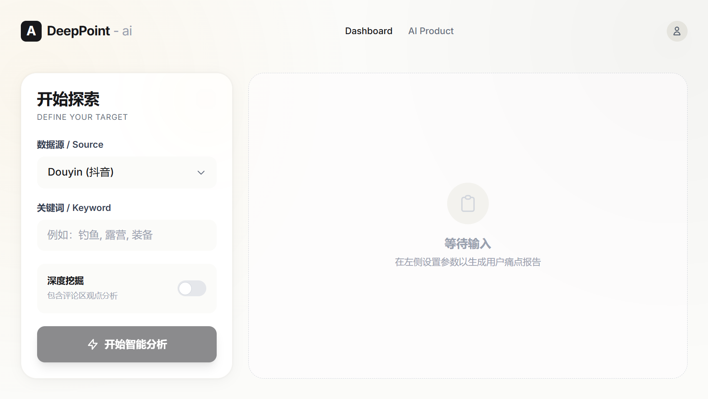

# DeepPoint - 用户痛点发现器

一个帮助个人开发者从社交媒体自动发现用户核心痛点的 Web 应用，支持智能聚类分析和 AI 产品方案生成。



## 功能特性

### 痛点分析模块
- 输入关键词自动抓取抖音相关视频和评论
- 基于文本相似度的智能聚类算法
- 调用 GLM 大模型分析用户付费意愿
- 可视化表格展示分析结果
- 一键导出 CSV 格式报告

### AI 产品建议模块
- AI 产品经理角色自动生成产品方案
- 包含核心功能、技术栈、开发路线图
- 评估实现难度和市场潜力

## 数据源说明

| 数据源 | 状态 | 说明 |
|--------|------|------|
| 抖音 | 可用 | 基于 DrissionPage 浏览器自动化，支持视频搜索和评论采集 |
| 小红书 | 暂停 | 测试发现会导致账号被封，暂不建议使用 |

## 快速开始

### 环境要求

- Node.js >= 18
- Python >= 3.10
- npm 或 pnpm

### 1. 安装依赖

```bash
# 克隆项目
git clone https://github.com/your-username/deeppoint-ai.git
cd deeppoint-ai

# 安装 Node.js 依赖
npm install

# 安装 Python 依赖
pip install DrissionPage beautifulsoup4 lxml
```

### 2. 配置环境变量

```bash
cp .env.example .env.local
```

编辑 `.env.local` 文件：

```env
# 智谱AI GLM API配置 (必需)
# 注册地址: https://open.bigmodel.cn/
GLM_API_KEY=your_glm_api_key_here

# 浏览器配置 (服务器环境设为 true)
HEADLESS=false
```

### 3. 运行项目

```bash
# 开发模式
npm run dev

# 生产构建
npm run build
npm run start
```

访问 http://localhost:3000

## 使用指南

### 痛点分析（主页）

1. 选择数据源（推荐使用抖音）
2. 输入关键词，多个用逗号分隔，如：`露营, 新手, 装备`
3. 可选开启「深度抓取」获取视频评论（更耗时但数据更丰富）
4. 点击开始分析，等待结果
5. 点击任意行查看详细原文，或导出 CSV

### AI 产品建议（/ai-product）

1. 输入目标领域的关键词
2. AI 将分析用户反馈，生成完整产品方案
3. 查看产品名称、功能、技术栈、开发计划等

## 项目结构

```
deeppoint-ai/
├── src/
│   ├── app/
│   │   ├── page.tsx              # 主页 - 痛点分析
│   │   ├── ai-product/page.tsx   # AI产品建议页
│   │   ├── layout.tsx            # 全局布局
│   │   └── api/
│   │       ├── analyze/          # 创建分析任务
│   │       ├── jobs/[jobId]/     # 查询任务状态
│   │       ├── analyze-ai-product/
│   │       └── ai-product-jobs/[jobId]/
│   └── components/
│       ├── AnalysisForm.tsx      # 分析表单
│       ├── JobStatus.tsx         # 任务状态显示
│       ├── ResultsTable.tsx      # 结果表格
│       ├── DetailModal.tsx       # 痛点详情弹窗
│       ├── AIProductCard.tsx     # AI产品卡片
│       ├── AIProductDetailModal.tsx
│       └── ExportButton.tsx      # CSV导出
├── lib/
│   ├── services/
│   │   ├── douyin-service.ts     # 抖音数据服务
│   │   ├── xhs-service.ts        # 小红书服务(暂停)
│   │   ├── glm-service.ts        # GLM大模型服务
│   │   ├── clustering-service.ts # 文本聚类
│   │   ├── job-manager.ts        # 任务管理
│   │   ├── ai-product-service.ts # AI产品分析
│   │   ├── ai-product-job-manager.ts
│   │   ├── data-source-factory.ts
│   │   └── data-source-interface.ts
│   ├── utils/
│   │   └── python-detector.ts    # Python命令检测
│   └── douyin_tool.py            # 抖音爬虫脚本
├── .env.example                  # 环境变量模板
├── package.json
├── requirements.txt              # Python依赖
└── tsconfig.json
```

## 技术栈

| 类别 | 技术 |
|------|------|
| 前端框架 | Next.js 15 + React 19 |
| 样式 | Tailwind CSS 4 |
| 数据请求 | SWR (轮询任务状态) |
| 后端 | Next.js API Routes |
| 数据采集 | Python + DrissionPage |
| AI 分析 | 智谱 GLM-4 |
| 聚类算法 | 基于 Jaccard 相似度 |

## API 配置

### 智谱 AI (必需)

1. 注册账号：https://open.bigmodel.cn/
2. 创建 API Key
3. 配置到 `GLM_API_KEY` 环境变量

## 常见问题

### Q: 抖音数据采集很慢？
A: 抖音使用浏览器自动化模拟真实用户，速度较慢是正常的。深度抓取模式会更慢但数据更完整。

### Q: 如何在服务器部署？
A: 设置 `HEADLESS=true` 环境变量启用无头浏览器模式。

### Q: 聚类结果太少？
A: 可以尝试更多关键词，或调整 `clustering-service.ts` 中的 `minClusterSize` 参数。

### Q: 小红书能用吗？
A: 暂不建议使用，测试发现会导致账号被封禁。

## 开发计划

- [x] 抖音数据源支持
- [x] 痛点聚类分析
- [x] AI 产品方案生成
- [x] 深度抓取（含评论）
- [ ] 更多数据源（知乎、微博）
- [ ] 历史记录保存
- [ ] 数据可视化图表

## 许可证

MIT License

## 致谢

- 抖音数据获取参考 [undoom-douyin-data-analysis](https://github.com/undoom/douyin-data-analysis)
